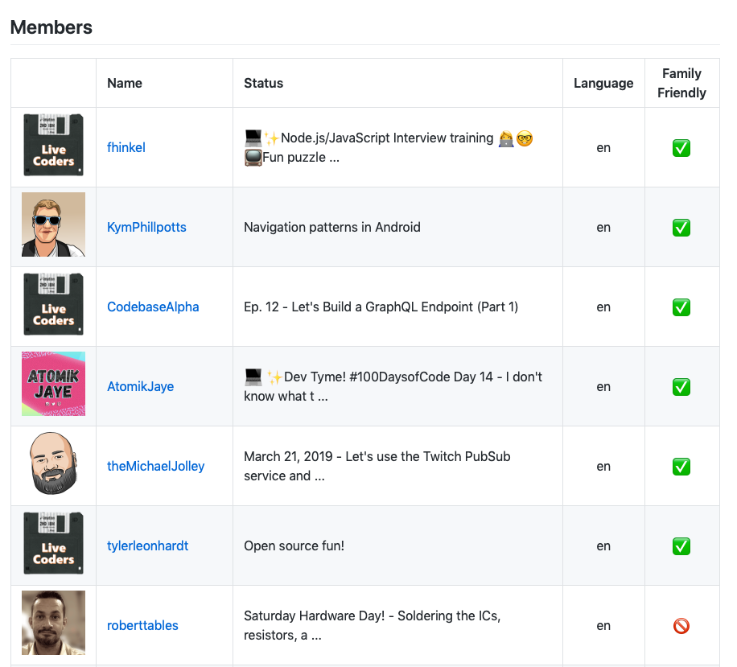

# Twitch Teams to Markdown converter
> A simple Python script das helps to transform Twitch API team data into a markdown table-based overview.

## Status

|Type|Status|
|----|------|
|Build (Travis)| - |

## Requirements

- Python 3.6.3
- `pip install requests`
- Twitch API client id (Developer Dashboard)[https://dev.twitch.tv/console/apps]

## Configuration

Open `converter.py` and fill in the required values for the properties `TWITCH_CLIENT_ID` and `TWITCH_TEAMS_NAME`.
To change the templates, have a look at the folder `templates/`.

## Run

```
> python twitch-teams-to-markdown-converter/converter.py
New markdown file has been generated.
Location: twitch-teams-to-markdown-converter/output.md
```

<a href="example.png"></a>

See [example](example.md).

## Contributing

Feel free to improve the quality of the code. It would be great to learn more from experienced Python developers.

## Authors

Just me, [Tobi]([https://tscholze.github.io).

## License

This project is licensed under the MIT License - see the [LICENSE](LICENSE.md) file for details.
Dependencies or assets maybe licensed differently.